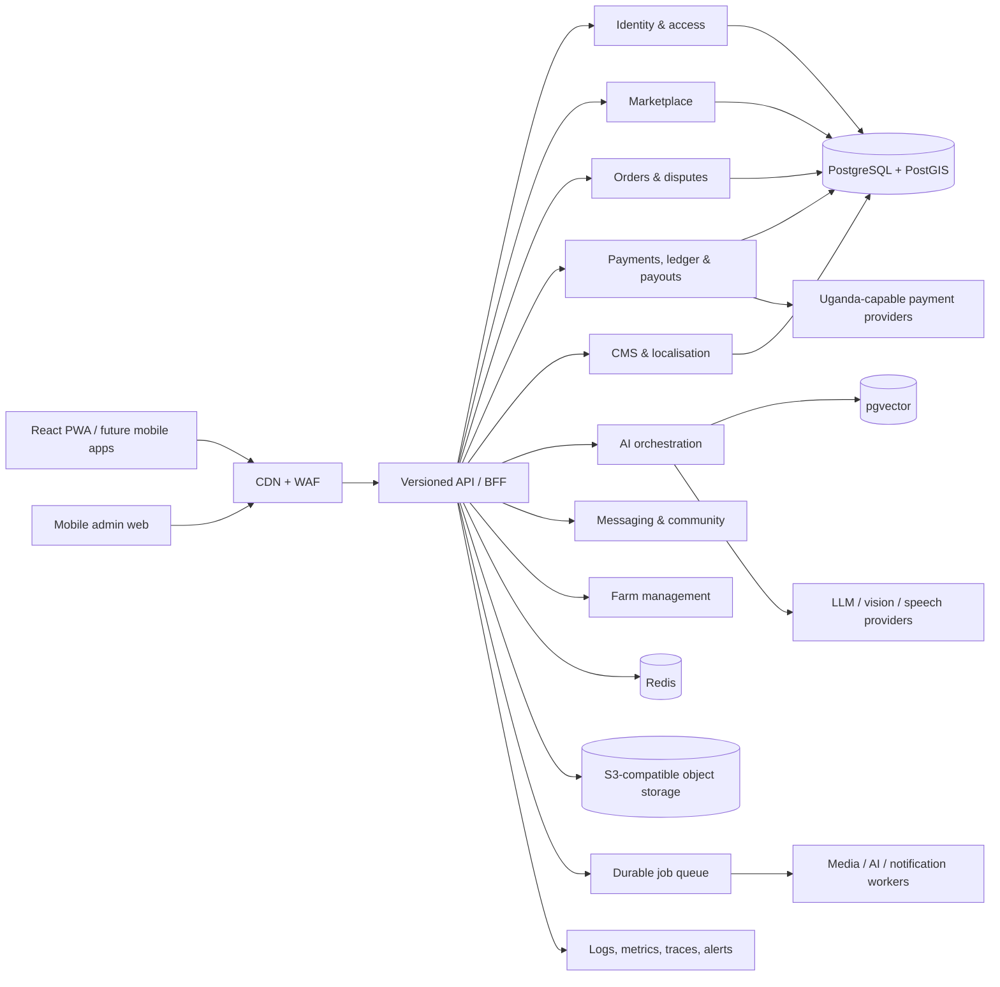
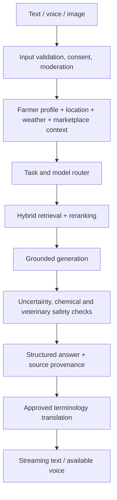
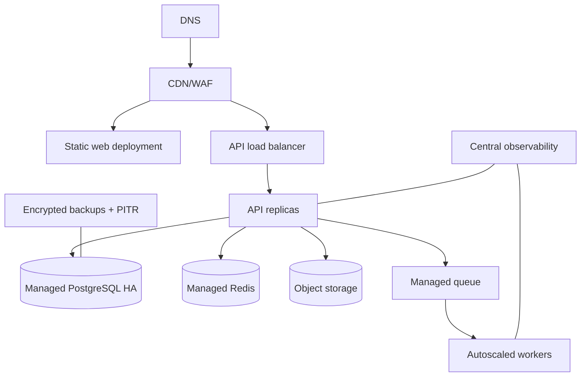

# Platform Architecture

**Status:** Architecture baseline for an incremental production build  
**Decision date:** 2026-08-16  
**Primary market:** Uganda; coffee-first; region-ready

## 1. System architecture

The platform is a modular monolith first, with explicit bounded contexts and event seams. This avoids the operational cost of premature microservices while preserving a migration path for payments, media, search, notifications, and AI workers.



### Bounded contexts

| Context | Owns | Critical rules |
|---|---|---|
| Identity | users, roles, sessions, MFA, verification | least privilege; separate admin policies |
| Marketplace | catalog, listings, media, search, buyer requests | configurable categories; approximate public location |
| Orders | carts, order lifecycle, fulfilment, reviews, disputes | explicit state machine; ownership checks |
| Finance | payment intents, provider events, ledger, commission, payouts | integer UGX; immutable entries; server-verified webhooks |
| Content | guides, alerts, prices, languages, translations, settings | publish workflow; cache tags and revalidation |
| AI | conversations, image analysis, RAG, usage policy, memory | evidence-aware; uncertainty and safety gates |
| Communication | conversations, messages, notifications, reports | spam controls; block/report; retention policy |
| Farm | farms, fields, activities, costs, yield | private by default |

### Technology decisions

- **Web/PWA:** React + TypeScript + Vite initially; route-level code splitting and hand-authored service worker. A Next.js public-content renderer may be introduced if server-side SEO needs outweigh bundle constraints.
- **API:** TypeScript + Fastify in the runnable foundation; production modules follow ports/adapters. OpenAPI is the contract.
- **Database:** PostgreSQL 16, PostGIS, pgvector. Prisma/Drizzle may generate type-safe access; SQL migrations remain authoritative.
- **Cache/queue:** Redis-compatible managed service and a durable queue. Payment events use an inbox table before asynchronous processing.
- **Media:** S3-compatible private buckets, signed uploads, CDN transformations, quarantine workflow.
- **Search:** PostgreSQL full text/trigram first; OpenSearch only after measured need.
- **Observability:** OpenTelemetry, structured JSON logs, privacy-filtered analytics, error monitoring.

## 2. Database ERD

The complete logical ERD is in [`ERD.md`](./ERD.md), and executable PostgreSQL DDL is in [`../database/schema.sql`](../database/schema.sql).

Design rules:

- UUIDv7/ULID identifiers reduce enumeration and index fragmentation.
- All money is integer minor units plus ISO-4217 currency; UGX has no fractional unit.
- Historical order and fee snapshots are immutable; never recalculate them from a changed product.
- Optimistic `version` columns protect offline edits.
- Soft deletion is used only where recovery or legal retention is required.
- Public location stores an administrative area and optional deliberately coarsened coordinates.
- Tenant-ready columns are deferred until a multi-country operator model is proven; country and currency are explicit now.

## 3. Database schema

Major schemas:

- `iam`: identity, RBAC, sessions, MFA, verification
- `market`: categories, listings, media, buyer requests, favourites
- `trade`: orders, order items, reviews, disputes
- `finance`: payment intents/events, commission rules, ledger accounts/entries, payouts/refunds
- `content`: articles, market prices, alerts, translations, settings
- `ai`: conversations, messages, analyses, documents, chunks, memories, usage
- `comm`: conversations, messages, notifications, reports
- `farm`: farms, fields, activities, expenses, harvests
- `audit`: append-only security and business audit records

The production migration policy is forward-only in production. Destructive changes use expand → migrate → contract releases.

## 4. API architecture

- Prefix: `/api/v1`.
- JSON over HTTPS; `application/problem+json` errors with safe user messages and trace IDs.
- Cursor pagination, sparse field sets only where needed, ETags for public content.
- Idempotency keys are mandatory for order creation, payment initiation, refunds and payouts.
- REST commands update the source of truth. WebSocket/SSE is reserved for chat, notifications and long AI responses.
- Generated clients share OpenAPI types with web and future native clients.

Representative resources:

```text
POST   /auth/register                 GET    /me
GET    /listings                      POST   /listings
GET    /listings/{id}                 POST   /orders
POST   /payment-intents               POST   /webhooks/payments/{provider}
GET    /market-prices                 POST   /buyer-requests
POST   /ai/conversations/{id}/messages
POST   /ai/image-analyses
GET    /content/articles              GET    /sync/changes?cursor=...
GET    /admin/dashboard               PATCH  /admin/settings/{key}
```

Every handler follows: authenticate → authorize resource/action → validate → execute domain service in transaction → audit → invalidate/publish → serialize.

## 5. Authentication architecture

- Registration accepts phone-first identity and optional email; OTP verifies ownership.
- Passwords use Argon2id with server-side pepper in a secrets manager.
- Browser sessions use rotating, opaque, high-entropy tokens in `HttpOnly`, `Secure`, `SameSite=Lax` cookies. CSRF tokens protect state-changing requests.
- Native clients use short-lived access tokens and rotating refresh tokens with reuse detection.
- Admin lives on a separate origin/entry point, requires phishing-resistant WebAuthn where possible or TOTP, and applies step-up authentication to financial/security changes.
- Recovery codes are one-time hashed values. SMS alone is not accepted for privileged roles.
- Authorization uses roles plus explicit permissions and resource ownership. Frontend visibility never replaces server authorization.
- Session/device view supports remote revocation; suspicious login and credential-stuffing controls are risk based.

## 6. Payment architecture

```mermaid
sequenceDiagram
  participant B as Buyer
  participant API
  participant PSP as Provider adapter
  participant DB as Finance DB
  B->>API: POST /orders + Idempotency-Key
  API->>DB: Snapshot items, fees; state=created
  B->>API: POST /payment-intents
  API->>DB: intent=initiated
  API->>PSP: Initiate mobile money/card
  PSP-->>B: Provider approval flow
  PSP->>API: Signed webhook
  API->>API: Verify signature, timestamp, amount, merchant
  API->>DB: Insert provider event (unique provider_event_id)
  API->>DB: Atomic status transition + balanced ledger entries
  API-->>PSP: 2xx after durable receipt
```

`PaymentProvider` is a port with `createIntent`, `query`, `verifyWebhook`, `refund`, and capability metadata. Adapters may support mobile money, cards, or bank transfer. The platform does not call settlement “escrow” unless the licensed provider contract actually provides it. No card PAN/CVV touches platform servers.

Provider credentials and callback allowlists are server-side. A reconciliation job compares provider reports to internal intents and ledger entries daily.

## 7. Commission architecture

Commission selection is deterministic and versioned:

1. seller exemption/promotion
2. listing/product override
3. category rule
4. global rule

Rules have scope, basis points or fixed amount, currency, validity interval, priority, minimum/maximum and author. At order creation, the chosen rule ID and complete calculation are snapshotted per line.

```text
gross = quantity × locked unit price
platform fee = round_half_up(gross × basis_points / 10,000)
net seller = gross − platform fee − seller-borne processing fees − refunds
```

UGX calculations use integers/BigInt. A double-entry ledger separates platform cash, seller payable, processor clearing, commission revenue, payment expense and refund liability. Ledger transactions must balance; entries are append-only and corrections reverse rather than mutate.

## 8. AI architecture



The orchestration layer—not the UI—owns provider choice, token budgets, prompts, safety policy and source permissions. Images are signature-validated, stripped of metadata, resized and compressed before analysis. Crop and animal output is probabilistic and explicitly avoids definitive diagnosis.

RAG ingestion: upload to quarantine → malware scan → parse/OCR → language detect → curator approval → semantic chunk → embed → index → evaluation set. Each chunk keeps source, page, publication/review date, authority level and crop/location tags. Retrieval prioritizes current Uganda-specific official and expert-reviewed sources.

Answers use a structured contract: `summary`, `possible_causes`, `checks`, `actions_now`, `prevention`, `warning`, `confidence`, `sources`, and optional follow-up question. High-risk pesticide and animal-health topics trigger stricter templates and escalation.

## 9. Translation architecture

- UI strings use versioned ICU message catalogues (`en`, `lg`, then `nyn`, `teo`, `ach`, `lgg`, `lus`, etc.).
- Content translations are separate records with workflow status and source revision; a changed source invalidates stale translations.
- Agricultural terminology uses an administrator-reviewed glossary with “do not translate”, preferred, and regional alternatives.
- Machine translation creates drafts only for curated content; reviewed status is visible internally.
- User-generated content can be translated on demand, labelled as machine translated, and cached by content hash.
- Locale, number, date and currency formatting use standards-based formatters; language is not treated as country.
- The runnable web client now loads a versioned language catalogue from `/api/v1/public/translations/:language`, caches it locally for low-data startup, and reapplies it to asynchronously rendered routes and validation messages.
- English is canonical. Luganda has complete draft catalogue coverage and is visibly labelled `draft` until entries are individually approved through the administrator translation review queue. Runyankole and Acholi remain disabled/planned rather than pretending incomplete translations are ready.
- Every translation approval requires `languages.manage`, CSRF protection and an audit event. Production persists catalogue entries in `content.ui_translations`; source changes return affected entries to review.

## 10. Voice architecture

1. Client checks provider/language capability and records only after explicit permission.
2. Audio is encoded at speech-appropriate quality, uploaded directly using a short-lived signed URL.
3. Speech worker performs VAD, STT and language confidence detection.
4. Transcript is shown for farmer correction before high-risk advice where practical.
5. AI response is generated in the canonical reasoning language, then reviewed glossary translation is applied.
6. TTS is generated only for supported high-quality voices; otherwise the UI states that voice is unavailable and shows text.

Audio retention is configurable and defaults to deletion after processing; transcript retention follows AI history consent. Web Speech APIs are an opportunistic client fallback, never the only production path.

## 11. CMS architecture

CMS uses the same domain APIs with stricter `/api/admin/*` policies. Content follows `draft → pending_review → approved → published → archived`; rejection records reason and reviewer. Four-eyes approval applies to market alerts, AI safety prompt changes and financial settings where feasible.

Settings are typed, versioned and scoped (`public`, `server`, `secret-reference`). Secrets are references to a secrets manager, never stored as CMS plaintext. Publishing writes an outbox event that invalidates cache tags and pushes a version signal to connected clients. No frontend rebuild is required.

## 12. File storage architecture

- Browser requests a signed upload session with declared purpose, size and type.
- Direct upload lands in a private quarantine prefix under a generated key.
- Worker checks extension, magic bytes, MIME, dimensions, decompression bombs and malware; normalizes orientation and strips metadata.
- Derivatives are produced as AVIF/WebP/JPEG at bounded sizes; only approved derivatives become public/CDN-addressable.
- Knowledge documents and identity evidence remain private with authorization-checked signed downloads.
- Lifecycle rules expire abandoned uploads and temporary AI media. Object versioning and cross-region replication follow recovery requirements.

## 13. Security architecture

Controls are threat-model driven (OWASP ASVS L2 baseline, higher for finance/admin):

- TLS, HSTS, CSP, frame restrictions, referrer and permissions policies.
- Parameterized database access, schema validation, contextual output encoding.
- CSRF tokens for cookie sessions; origin checks on sensitive requests.
- IP/account/device rate limits and progressive challenges.
- Resource-level authorization prevents IDOR.
- Signed webhooks with replay window, unique event IDs and reconciliation.
- Secret manager, key rotation, dependency/SAST/DAST/container scanning.
- Append-only audit trail copied to restricted retention storage.
- Data classification, minimization, encryption at rest and field-level encryption for identity evidence.
- Incident response runbooks, RPO/RTO targets and tested restores.

See [`SECURITY.md`](./SECURITY.md) for misuse cases and release gates.

## 14. PWA architecture

The service worker versions and precaches only the application shell. Runtime strategies:

| Resource | Strategy |
|---|---|
| Hashed assets | cache first |
| public categories/articles | stale while revalidate |
| listing thumbnails | cache with LRU/size cap |
| prices | network first with explicit last-updated value |
| orders/wallet/payments | network only; cached screens must be visibly stale |
| POST drafts/uploads | IndexedDB outbox with idempotency key |

Offline drafts carry client IDs and base versions. Sync applies server validation and exposes conflicts instead of silently overwriting. Background sync is progressive enhancement; foreground retry works everywhere. Push payloads contain no sensitive details and deep-link to authenticated data.

## 15. Deployment architecture



Development, staging and production use isolated accounts, databases, buckets and credentials. Infrastructure is code-reviewed. Deployments run migrations as a guarded job, use health/readiness probes, canary/rolling release, automatic rollback, and post-deploy smoke tests. Database RPO target is ≤15 minutes with PITR; the restoration objective and RTO are tested quarterly before being trusted.

## 16. UI/UX design system

Design principles: farmer-first, camera/voice-forward, one clear primary action, plain language, transparent money, 44px+ touch targets, resilient contrast, reduced-motion support, and useful states.

Tokens:

- primary `#135C3A` (configurable), secondary coffee gold `#D39A2C`
- neutral warm backgrounds and near-black text
- danger, warning, info and success always pair icon/text with colour
- Inter-compatible UI stack and Noto-compatible Unicode fallback
- 4/8px spacing rhythm; 12/16/24px radii by component hierarchy
- mobile bottom navigation; desktop contextual sidebar and constrained reading widths

Core patterns: product card, price/source card, opportunity card, verified identity, trust panel, AI structured answer, image uploader, stepper, fee breakdown, order timeline, empty/error/offline/skeleton states. A data-saver preference suppresses nonessential media and shrinks page sizes.

## 17. Component architecture

```text
AppShell
├── Navigation (DesktopSidebar, MobileTopbar, BottomNavigation)
├── Feedback (Toast, InlineError, OfflineBanner, Skeleton, EmptyState)
├── Primitives (Button, Input, Select, Dialog, Drawer, Tabs, Badge, Avatar)
├── Marketplace (SearchBar, FilterChips, ProductCard, ListingWizard, FeeBreakdown)
├── Coffee (PriceCard, BuyerRequestCard, KnowledgeCard, CalendarItem)
├── AI (ConversationList, AIMessage, VoiceButton, ImageInput, Sources, SafetyCallout)
├── Trade (OrderCard, OrderTimeline, PaymentMethod, DisputePanel)
├── Content (ArticleCard, AlertCard, LanguageSelector)
└── Admin (StatCard, ApprovalQueue, SettingEditor, AuditTable)
```

Feature modules consume typed API clients, never database shapes. Server state, ephemeral UI state, persisted preferences and offline outbox are kept separate. Components use semantic HTML and are tested with keyboard and screen-reader assertions.

## 18. Development roadmap

Detailed acceptance gates are in [`ROADMAP.md`](./ROADMAP.md). Delivery order:

- **Phase 0:** threat model, user research, data/payment provider due diligence, architecture, design tokens.
- **Phase 1:** identity, farmer/buyer profiles, categories, listings/media, search, admin moderation, PWA shell.
- **Phase 2:** coffee dashboard, prices with provenance, buyer requests, coffee-specific listing metadata and knowledge.
- **Phase 3:** grounded text AI, history, image analysis, expert escalation and evaluations.
- **Phase 4:** reviewed Luganda UI/content glossary, STT/TTS capability matrix and voice UX.
- **Phase 5:** provider sandbox, orders, verified webhooks, immutable ledger, commission, payouts, refunds and reconciliation.
- **Phase 6+:** messaging/reviews/ads, farm management, additional languages, optimization and measured service extraction.

No phase exits on UI completion alone: domain tests, security tests, accessibility, performance budgets, operations, support runbooks and data governance are part of done.
