# Logical database ERD

The diagram highlights ownership and transaction boundaries; `database/schema.sql` contains constraints and supporting tables.

```mermaid
erDiagram
  USERS ||--o| FARMER_PROFILES : has
  USERS ||--o| BUYER_PROFILES : has
  USERS ||--o{ USER_ROLES : assigned
  ROLES ||--o{ USER_ROLES : includes
  ROLES ||--o{ ROLE_PERMISSIONS : grants
  PERMISSIONS ||--o{ ROLE_PERMISSIONS : maps
  USERS ||--o{ SESSIONS : authenticates
  USERS ||--o{ VERIFICATIONS : requests

  FARMER_PROFILES ||--o{ FARMS : owns
  FARMS ||--o{ FARM_CROPS : grows
  CATEGORIES ||--o{ CATEGORIES : parent
  CATEGORIES ||--o{ LISTINGS : classifies
  USERS ||--o{ LISTINGS : sells
  LISTINGS ||--o{ LISTING_MEDIA : displays
  LISTINGS ||--o| COFFEE_DETAILS : specifies
  USERS ||--o{ BUYER_REQUESTS : posts

  USERS ||--o{ ORDERS : buys
  USERS ||--o{ ORDERS : sells
  ORDERS ||--|{ ORDER_ITEMS : contains
  LISTINGS ||--o{ ORDER_ITEMS : snapshots
  ORDERS ||--o{ PAYMENT_INTENTS : paid_by
  PAYMENT_INTENTS ||--o{ PAYMENT_EVENTS : receives
  ORDERS ||--o{ COMMISSION_SNAPSHOTS : charges
  COMMISSION_RULES ||--o{ COMMISSION_SNAPSHOTS : selected
  LEDGER_TRANSACTIONS ||--|{ LEDGER_ENTRIES : balances
  LEDGER_ACCOUNTS ||--o{ LEDGER_ENTRIES : receives
  ORDERS ||--o{ REVIEWS : permits
  ORDERS ||--o{ DISPUTES : may_have
  ORDERS ||--o{ REFUNDS : may_have
  USERS ||--o{ PAYOUTS : receives

  USERS ||--o{ AI_CONVERSATIONS : starts
  AI_CONVERSATIONS ||--|{ AI_MESSAGES : contains
  AI_MESSAGES ||--o{ AI_IMAGE_ANALYSES : references
  KNOWLEDGE_DOCUMENTS ||--|{ KNOWLEDGE_CHUNKS : split_into
  KNOWLEDGE_CHUNKS }o--o{ AI_MESSAGES : cited_by

  ARTICLES ||--o{ ARTICLE_TRANSLATIONS : localised_as
  LANGUAGES ||--o{ ARTICLE_TRANSLATIONS : language
  LANGUAGES ||--o{ UI_TRANSLATIONS : language
  CATEGORIES ||--o{ MARKET_PRICES : priced

  USERS ||--o{ CONVERSATIONS : participates
  CONVERSATIONS ||--o{ MESSAGES : includes
  USERS ||--o{ NOTIFICATIONS : receives
  USERS ||--o{ REPORTS : files
  USERS ||--o{ AUDIT_LOGS : acts
```

## State machines

### Listing

`draft → pending_review → published → paused → sold/expired/archived`, with `rejected` from review and admin suspension from any public state.

### Order

`created → payment_pending → payment_verified → processing → ready_for_delivery → delivered → completed`

Exceptional paths: `cancelled`, `refund_pending → refunded`, and `disputed` with controlled resume/resolution transitions. Transitions are rows in an order event table, not inferred from timestamps.

### Payment

`created → provider_pending → verified → settled`, or `failed`, `cancelled`, `expired`, `refund_pending → partially_refunded/refunded`. Provider event receipt and business transition are separate, idempotent operations.

### Content

`draft → pending_review → approved → published → archived`; stale translations return to `needs_review` when source revision changes.
